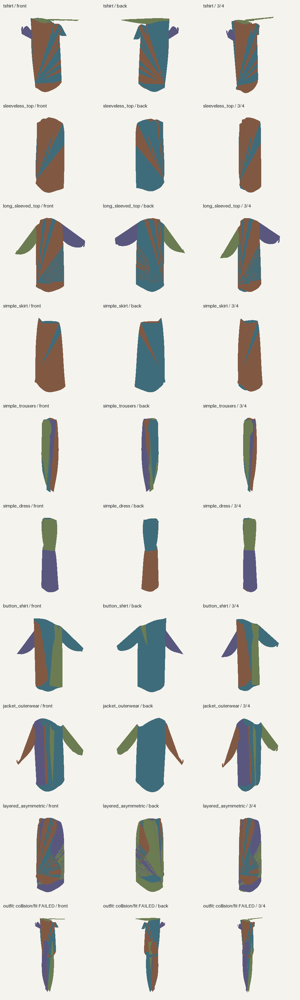

# Package Outfit / Runtime Development Evidence

**Fit quality remains failed: 0/40 fit-ready states, 40/40 valid conventional meshes.**
All 30 adjacent queries executed and all 13 negative controls rejected correctly.
Runtime: 36/36 family + 4/4 binding + 4/4 outfit rows, 22 deterministic pairs and
43 passing controls. Static: nine families pass Z4/Z5/Z6/Z8; Z3/Z7 and dynamic Z2
remain unexecuted. No physical, mobile or product qualification follows.

- [Readable outcomes](summary.json)
- [Current Phase 0-14 evidence overlay](blueprint_current.json)
- [Actual-geometry inspection](demo/index.html)
- [Full human-readable results and limitations](../../family_binding_outfit_results_v1.md)
- [Archive format and bounded verification command](../../outfit_evidence_archive_v1.md)

`receipts.zip` preserves all 531 expanded files (46353259 bytes) in 7378811 bytes.
Two builds were byte-identical; bounded extraction verified every original size and
SHA-256. The expanded publisher passed its source/input freshness and evidence-hygiene
checks. See `archive_envelope.json` for the ZIP hash and exact visible-copy hashes.

`expanded-metadata/publication_manifest.json` and `projection_manifest.json` describe
members inside the ZIP, **not this compact outer directory**. Published JSON/text are
explicit portable projections; embedded original source digests continue to identify
the raw local receipts. No producer result, failed row or witness was overwritten.
Binary garment inputs and conventional models remain in the documented local output
roots; this evidence archive is not a standalone model bundle.

The archive includes prior failed/interrupted attempts and a prepublication validation
snapshot. That snapshot explicitly marks the full local suite as running. Actual
post-commit local exit and final-head CI outcomes are attached to the final draft PR
handoff. Collected test identities are published as exact SHA-256 values because raw
parameterized names include adversarial URI/token examples. All 1502 raw collected IDs
and shard membership remain retained locally; no test or privacy check was removed.

Historical acceptance fields in the roadmap are retained for comparison; current
scoped B/C outcomes are additive. Consult the human-readable current table rather
than treating a historical failed gate as a new result or CI as garment acceptance.

